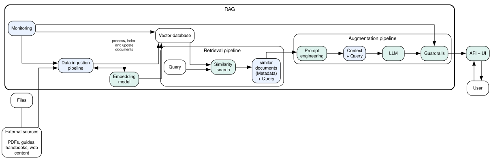

# RAG Pipeline — First Project

A local, reproducible **Retrieval-Augmented Generation (RAG)** system built over a multi-week internship. The core pipeline lives in a single framework ([`tragframe.py`](tragframe.py)); Jupyter notebooks cover the learning path (weeks 1–5) and the main entry point for running and evaluating the system ([`notebooks/rag_run.ipynb`](notebooks/rag_run.ipynb)).

---

## Overview

- **Framework:** [`tragframe.py`](tragframe.py) — ingest (PDF), chunk (300/50), embed (HashingVectorizer 768-dim), index (FAISS), pre/post guardrails, and RAG retrieval + LLM generation. No CLI; use the notebooks or import the module.
- **Entry point:** [`notebooks/rag_run.ipynb`](notebooks/rag_run.ipynb) — config, index build, retrieval evaluation on `eval/eval.jsonl`, and an interactive “Ask” widget to query the RAG.
- **Notebooks (learning path):** Week 1 (embedding comparison), Week 2 (FAISS retrieval pipeline), Week 3 (LLM integration and prompts), Week 4 (guardrails and output controls), Week 5 (evaluation and optimization). They can use their own code or the framework depending on the cell; `rag_run` and evaluation are fully framework-based.
- **Evaluation:** Shared eval set in [`eval/eval.jsonl`](eval/eval.jsonl) with `query`, `topic`, and optional `gold_sources` / `gold_keywords` (and `gold_chunk_ids`). The framework’s `RAG.evaluate()` computes hit@1/3/5 and MRR@5 and writes `runs/<run_id>/60_eval_report.json`.

---

## Quick start

1. **Setup**

```bash
python -m venv rag_env
source rag_env/bin/activate   # or: rag_env\Scripts\activate on Windows
pip install -r requirements.txt
```

Ollama is required for LLM generation:

```bash
ollama pull gemma3:4b
ollama serve
```

2. **Run the pipeline and ask questions**

- Open [`notebooks/rag_run.ipynb`](notebooks/rag_run.ipynb).
- Run cells 1–3 (imports, config, init: `Monitor`, `VectorDatabase`, `db.update_database(DATA_DIR)`, `RAG` with `llm_client`).
- Run the “Run retrieval evaluation” cell to run `rag.evaluate(EVAL_PATH, top_k=TOP_K)` and see hit@k / MRR and failures.
- Run the “Ask” cell to get the interactive query box; type a question and click Ask to get a grounded answer with sources.

3. **Optional: deeper evaluation**

- Use [`notebooks/week5_evaluation_and_optimization.ipynb`](notebooks/week5_evaluation_and_optimization.ipynb) for the same `rag.evaluate()` plus topic-on/off comparison, chunking comparison (300/50 vs 300/75), latency measures, relevance labeling, and prompt comparison (baseline vs grounded).

---

## Repository structure

| Path | Purpose |
|------|--------|
| `tragframe.py` | Core RAG framework: `Monitor`, `VectorDatabase`, `RAG` (ingest, chunk, embed, FAISS, guardrails, `recover`, `retrieve`, `evaluate`) |
| `llm_client.py` | Thin Ollama LLM wrapper (`gemma3:4b`) used by `rag_run`; keeps LLM dependency out of tragframe |
| `notebooks/rag_run.ipynb` | Main entry: init framework, run evaluation, interactive Ask |
| `notebooks/week1.ipynb` | Embedding and similarity comparison (e.g. MiniLM vs MPNet) |
| `notebooks/week2_faiss_retrieval_pipeline.ipynb` | Building the retrieval pipeline: load PDFs, chunk, embed, FAISS index, search |
| `notebooks/week3_llm_integration_and_prompts.ipynb` | Adding LLM and prompt templates on top of retrieval |
| `notebooks/week4_guardrails_and_output_controls.ipynb` | Pre/post guardrails (PII, injection, toxicity, retrieval quality, uncertain language, data leakage) |
| `notebooks/week5_evaluation_and_optimization.ipynb` | Evaluation and optimization: `rag.evaluate()`, topic/chunking comparison, latency, relevance labels, prompt comparison |
| `eval/eval.jsonl` | Shared evaluation set (query, topic, gold_sources, gold_keywords; optional gold_chunk_ids) |
| `data/<topic>/*.pdf` | Input documents; folder name = topic label (e.g. RAG, GIT, GCP) |
| [`data/RAG_Architecture.dot`](data/RAG_Architecture.dot) | Graphviz source for the architecture diagram |
| [`data/graphviz.svg`](data/graphviz.svg) | Rendered architecture diagram (User → API, ingestion, retrieval, augmentation, monitoring) |
| `runs/<run_id>/` | Per-run artifacts: config, ingest summary, retrieval debug, generation debug, eval report, timings |
| `artifacts/` | Notebook outputs (e.g. week2/week3/week5 CSVs and JSONL) |

---

## Architecture diagram

High-level RAG flow: User/API, external sources → ingestion → embedding → vector DB → retrieval (query → similarity search → context) → augmentation (prompt → LLM → guardrails) → response. Source: [`data/RAG_Architecture.dot`](data/RAG_Architecture.dot); rendered diagram:



---

## How the pipeline works

```
data/<topic>/*.pdf
        │
        ▼  ingest (PyPDFLoader)
   raw pages + topic label
        │
        ▼  chunk (RecursiveCharacterTextSplitter: 300 chars, 50 overlap)
   DocumentChunk list
        │
        ▼  embed (HashingVectorizer 768-dim, lowercase)
   float32 vectors
        │
        ▼  index (FAISS IndexFlatIP)
   vector store
        │
   ─────┼───────────────────── query time ──
        │
   user query
        │
        ▼  pre-guardrails (PII, injection, toxicity, competitor, retrieval quality)
        │
        ▼  VectorDatabase.recover(query, top_k, topic?)
   top-k chunks + scores + refs
        │
        ▼  RAG.retrieve()  →  LLM (Ollama gemma3:4b via llm_client)
   grounded answer + citations
        │
        ▼  post-guardrails (data leakage, uncertain language, empty answer)
        │
        ▼  Monitor
   runs/<run_id>/  artifacts
```

- **Guardrails:** Refusal reasons (e.g. “No relevant context retrieved”, “Potential prompt injection detected”) are defined in `tragframe` and applied before and after the LLM. Similarity threshold and ambiguity gap control when retrieval is accepted.
- **Evaluation:** `RAG.evaluate(eval_path, top_k=5, use_topic=True)` reads JSONL, runs retrieval (with optional topic filter), and scores each line using gold_sources / gold_keywords / gold_chunk_ids. Results are in the returned dict and in `60_eval_report.json`.

---

## Data layout

Place documents under `data/<topic>/`:

```
data/
  RAG/
    paper.pdf
    readme.pdf
  GIT/
    guide.pdf
  GCP/
    intro.pdf
```

Supported formats: PDF (via PyPDFLoader). Topic label = subfolder name (e.g. `RAG`, `GIT`, `GCP`).

---

## Evaluation (eval.jsonl)

Each line is a JSON object. Required: `query`. Optional: `id`, `topic`, `gold_chunk_ids`, `gold_sources`, `gold_keywords`. Example:

```json
{"id": "rag1", "query": "What is RAG?", "topic": "RAG", "gold_sources": ["readme"], "gold_keywords": ["Retrieval-Augmented Generation", "retriever"]}
{"id": "out1", "query": "What is the capital of France?"}
```

- With `use_topic=True`, retrieval can be restricted to chunks whose topic matches the row’s `topic`.
- A hit is correct if it matches any of: chunk_id in gold_chunk_ids, ref source contains a gold_sources substring, or chunk text contains a gold_keywords substring.
- Rows with no gold fields are still counted in `n` but do not contribute to hit/MRR.

Run evaluation in **rag_run** (one cell) or in **week5** (same `rag.evaluate()` plus comparisons and tables).

---

## Output artifacts (runs/)

Every run writes to `runs/<run_id>/`:

| File | Contents |
|------|----------|
| `00_config.json` | Embedding dim, chunk size, overlap, top_k_default |
| `10_ingest_summary.json` | Pages loaded, chunks created, ntotal |
| `30_retrieval_debug.json` | Last query, top-k results, scores, timings |
| `40_generation_debug.json` | Guardrail outcome, model, raw answer (when LLM is used) |
| `60_eval_report.json` | hit@k and MRR@5 per run (when `evaluate()` is called) |
| `90_timings.json` | ms per stage: ingest, chunk, embed, index, search |

---

## Key design decisions

| Decision | Reason |
|----------|--------|
| HashingVectorizer (768-dim) instead of sentence-transformers | Stable in constrained environments; no OOM; deterministic; no download |
| FAISS IndexFlatIP | Inner product similarity; no training |
| Chunking 300 / 50 | Fixed baseline across weeks; tunable in framework and compared in week5 |
| Pre- and post-guardrails | Block PII, injection, toxicity, low retrieval quality, data leakage, uncertain language |
| Topic from folder name | No extra NLP at ingest; optional topic filter at query time |
| Single framework (tragframe) | One place for ingest/chunk/embed/retrieve/guardrails so rag_run and week5 share the same pipeline and metrics |

---

## Requirements

See [requirements.txt](requirements.txt). Key dependencies: `faiss-cpu`, `langchain-community`, `langchain-text-splitters`, `langchain-ollama`, `pypdf`, `scikit-learn` (for HashingVectorizer), `numpy`, `pandas`. For notebooks: `ipykernel`, `ipywidgets`.
